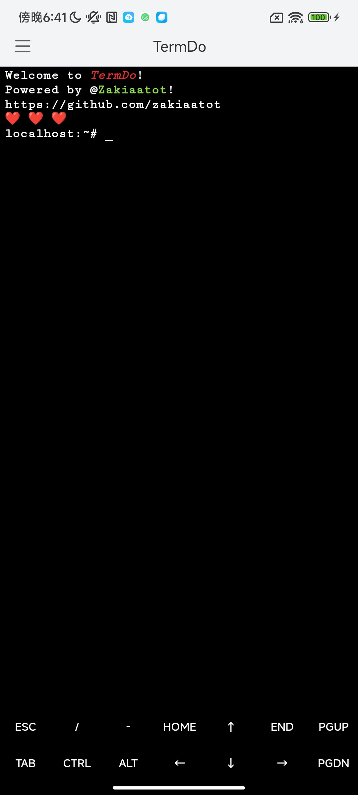
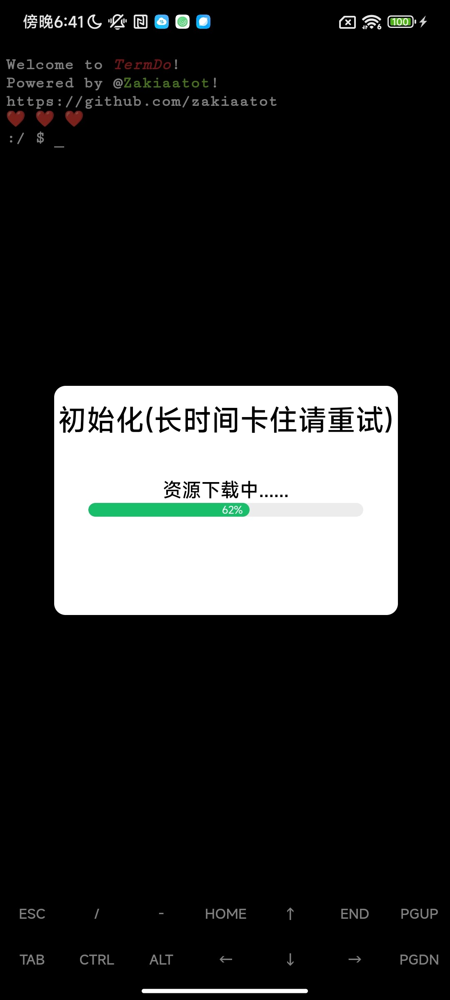
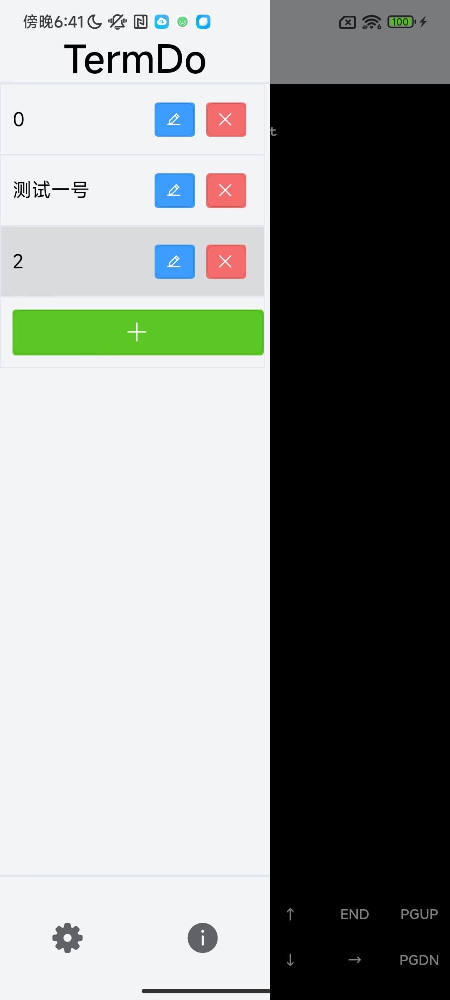
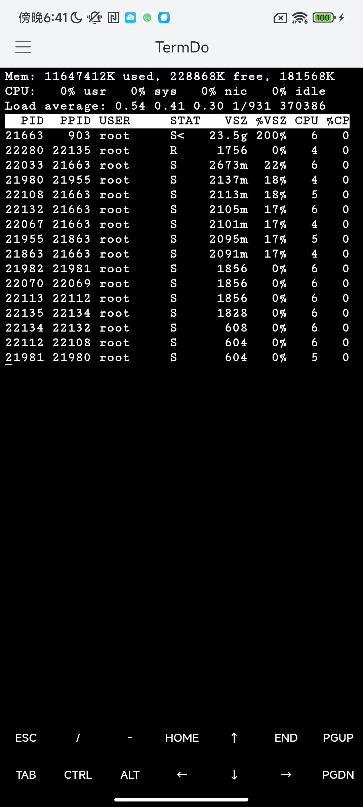
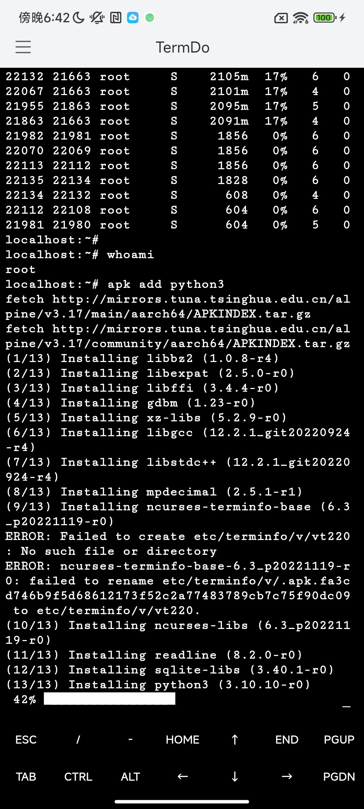

# TermDo_app

TermDo 是一个安卓终端模拟器, 类似于termux,termare
采用uniapp, native plugin, jni实现

> 注意：目前正在开发中,功能还不够完善
> 
> 目前仅支持aarch64机型。。。

## 下载安装

[TermDo dev](https://github.com/Zakiaatot/TermDo_app/releases/download/dev/TermDo_v1.0.1_aarch64_dev.apk)

## 灵感来源

> 起源于我的另一个项目,flycore_alioth_docker, 安卓上能实现docker了,我想着能不能开发一个简易的docker配置终端？

## 相关及技术栈
`感谢！`

### view部分

- [uniapp](https://uniapp.dcloud.net.cn/)
- [uview-plus](https://uiadmin.net/uview-plus/)
- [xterm.js](https://xtermjs.org/)
  
### 功能部分

- [termux](https://github.com/termux)
- [termare](https://github.com/termare)

## TODO
> 更加完善的rootfs系统，正在考虑修改编译termux的pacakage作为己用....

## 更多截图

>完整体验可下载尝试！